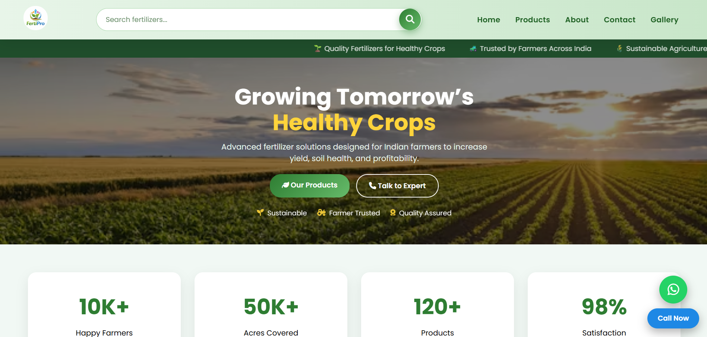
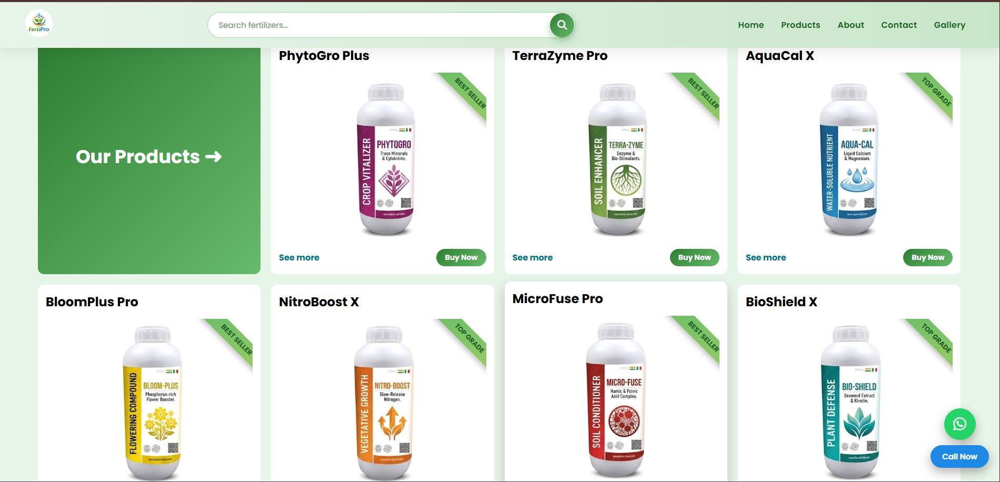
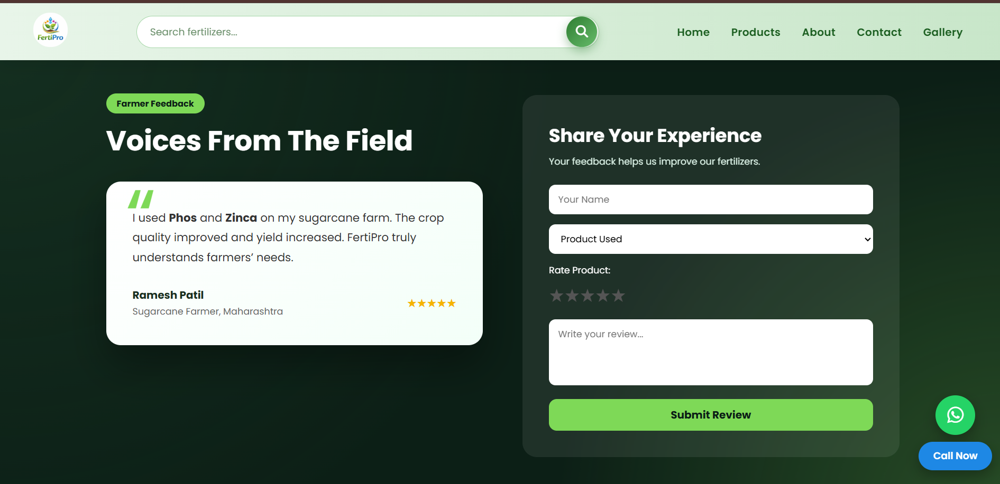
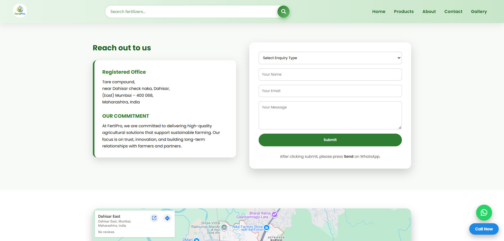
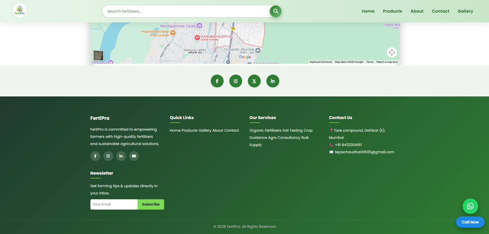

# 🌱 FertiPro – Smart Fertilizer Website

FertiPro is a modern and responsive agricultural website designed to showcase fertilizer products and smart farming solutions. The project focuses on clean UI, structured product presentation, and a user-friendly experience.

---

## 🚀 Features

- 🌿 Product catalog with detailed product information (See More modal)
- 🔍 Interactive search functionality
- 📱 Fully responsive design (mobile-friendly)
- 🎨 Modern UI with smooth animations and hover effects
- 🧭 Multi-page navigation (Home, Products, Gallery, About, Contact)
- 🖼️ Image gallery with responsive grid layout
- 📦 Product cards with "Buy Now" and "See More" options
- 📞 Contact form with product selection dropdown
- 📍 Google Map integration and contact details
- 💬 Floating WhatsApp and Call buttons
- ⭐ Customer review section and testimonials

---

## 🛠️ Tech Stack

- HTML5  
- CSS3 (Flexbox, Grid, Responsive Design)  
- JavaScript  

---

## 📂 Project Structure

FertiPro/
│── index.html # Homepage
│── product.html # Product details & shop section
│── gallery.html # Image gallery
│── about.html # About company
│── contact.html # Contact form + map
│── style.css # Styling (internal + external)
│── script.js # Functionality (search, navigation)
│── /images # Product & UI images

---

## ⚠️ Important Note

This project is a recreated version of a real-world client project.

Due to confidentiality and privacy reasons:
- All branding, product names, and contact details have been modified  
- No sensitive or client-specific data is included  

This version is created purely to demonstrate frontend development skills and project structure.

---

## 💡 Key Highlights

- Based on a real-world business website  
- Rebuilt with custom branding (**FertiPro**)  
- Focused on UI/UX and responsive design  
- Demonstrates practical frontend development skills  

## 📸 Screenshots

## 🌍 Live Demo

🔗 https://tejaschaudhari05.github.io/FertiPro-Smart-Fertilizer-Website/

---

## 🔗 GitHub Repository

🔗 https://github.com/tejaschaudhari05/FertiPro-Smart-Fertilizer-Website

---

## 📬 Contact
📧 Email: tejaschaudhari0505@gmail.com  
🔗 LinkedIn: www.linkedin.com/in/tejas-chaudhari-821400380  
💻 GitHub: https://github.com/tejaschaudhari05  
---

⭐ If you found this project useful, consider giving it a star!
